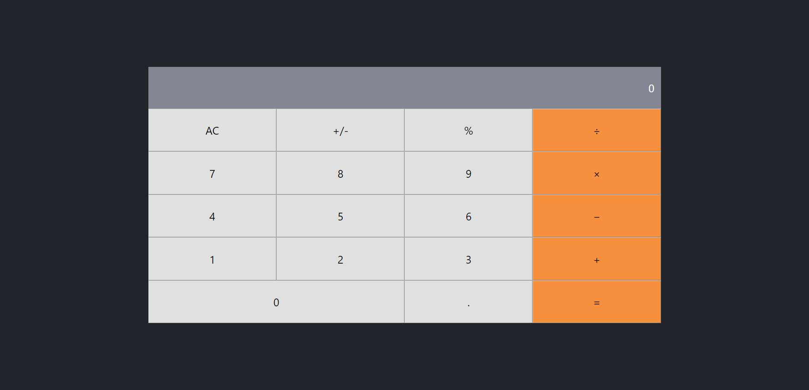

# Math Calculator

> Single Page Web Application that have the following features:
>
> - Addition
> - Subtraction
> - Multiplication
> - Division
> - Modulus
> - display current time

## screenshot

| *A Screenshot of the Desktop Version of the App*

## Built With

- Languages: _**HTML5, CSS3**_
- Frameworks: _**React, Redux, React-Router**_
- Technologies used: _**GIT, GITHUB, LINTERS**_

## Getting Started

To get this project up and running, follow these simple steps:

1. Clone the repository into your machine.
2. Open the project's folder with your preferred source-code editor.
3. Run `npm install`.
4. Run `npm start`.

## Authors

- **GitHub**: 
- **Twitter**: 
- **LinkdIn**: 

## 🤝 Contributing

Contributions, issues, and feature requests are welcome!

Feel free to check the [issues page](../../issues).

## Show your support

Give a ⭐️ if you like this project!

## 📝 License

This project is [MIT](./MIT.md) licensed.
